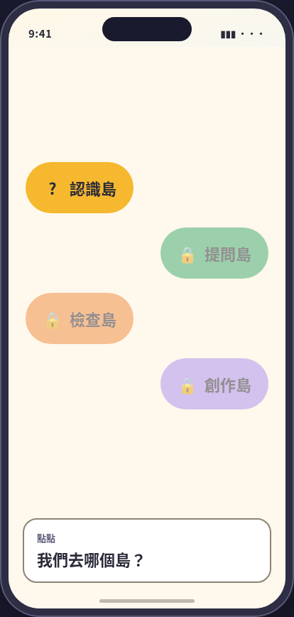
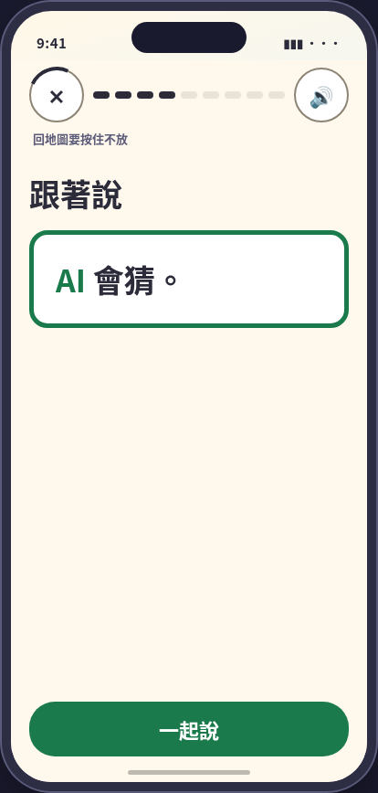
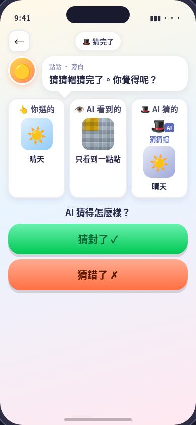
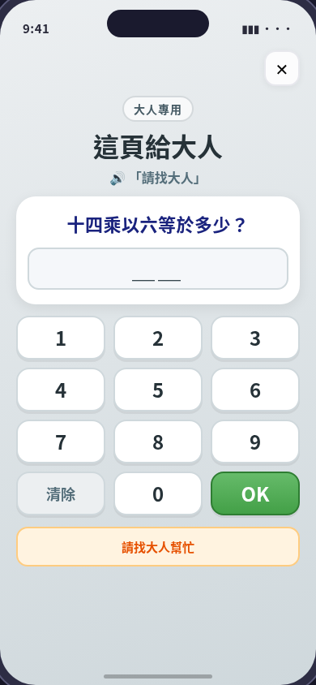
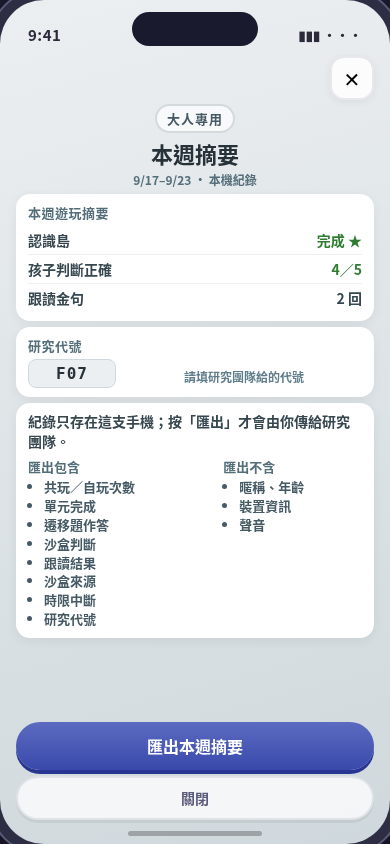

# 設計對照（design map）

功能 → Notion mid-fi 屏號與版本 → App 目前和設計稿的差異。改到畫面時，拿證據對照這裡的設計稿，列出**新的**差異；審查者（Codex、Grok）也照這份對照。

- 設計稿：[`design/midfi/`](../../../../design/midfi/)（mid-fi v1.2.2，2026-09-23；來源與版本見該資料夾的 README）。
- 內容以 repo 的 `content/` 為準（AGENTS.md：內容的唯一真實版本）；設計稿上的文字和內容 JSON 不同時，以內容 JSON 為準，不算差異。
- 差異的分類：
  - **有出處**：已有決定，寫明出處。
  - **已定**：Michael 已定是保留 App 的做法、改 App，還是改設計；多數記在 [首版範圍](../../../../docs/first-release-scope.md)。
  - **延後**：設計稿有、App 沒有，而且確定不在首版。
  - **待決策**：還要 Michael 決定，寫明要等什麼。
  - **待確認**：App 和設計稿不同，但找不到決定的出處（新發現的差異先標這個）。
  - **尚未實作**：設計稿有、App 還沒有，也還沒決定要不要做。

## 對照表

| mid-fi 屏 | 對到的功能與進入點 | 設計稿 |
|---|---|---|
| 01 地圖首頁（2026-10-01 對齊 App） | [map](./features/map.md)：`app-launch`、`map-unlock` |  |
| 02 單元 1 跟讀（2026-10-01 對齊 App） | [say-together](./features/say-together.md)：`button`（單元 1 `--beat 3`） |  |
| 03 沙盒 A｜猜猜帽（v1.2） | [sandbox](./features/sandbox.md)：`sandbox-ritual`＋單元 1 沙盒開頭（`--unit 0 --beat 4`、`--beat 5`） |  |
| 04 沙盒 B｜猜對示範（v1.2.2） | [sandbox](./features/sandbox.md)：`sandbox-open` 的反應畫面（單元 1 `--beat 5`） |  |
| 04b 沙盒 B｜猜錯變體（v1.2.2） | 同 04 |  |
| 05 家長閘（v1.2） | 沒有對到的功能（尚未實作） |  |
| 06 家長本週摘要＋匯出（v1.2.2） | 沒有對到的功能（尚未實作） |  |

沙盒的三圖比較（`sandbox-compare`，單元 2 兩張卡都玩完）沒有 mid-fi 屏；規格以 Notion 設計決定 D37「同尺寸排成一列」為準（2026-10-01 起外框同尺寸、圖用同一倍率）。

沒有對到設計稿的功能：[choice-question](./features/choice-question.md)、[drag](./features/drag.md)、[story](./features/story.md)、[review-and-sticker](./features/review-and-sticker.md)、[system-states](./features/system-states.md)、[observer-menu](./features/observer-menu.md)。這些畫面沒有 mid-fi，只對照功能檔與 `design/tokens/kidsai.tokens.json`。

## 差異

### 01 地圖首頁

2026-10-01 Grok 照[首版範圍](../../../../docs/first-release-scope.md)把設計稿改成 App 現況（拿掉家長齒輪、時間晶片、貼紙本；問句框在下方；四島左右交錯），目前沒有差異。
- **有出處**：第三島設計稿叫「查證」，App 叫「檢查島」— 以內容 JSON（`unit_3_verify` 的標題「檢查島：當個小偵探」）為準。

### 02 單元 1 跟讀

2026-10-01 Grok 照[首版範圍](../../../../docs/first-release-scope.md)把頂列改成 X、進度點、🔊，並拿掉麥克風、只留「一起說」（語音辨識首版不含）。剩下的差異：

- **待確認**：設計稿在 X 下方一直顯示「回地圖要按住不放」；App 只有輕點 X 時才出現「按住不放」。
- **待確認**：App 在句子卡上方有點點的指示框「按一下嘴巴按鈕，我們一起說。」；設計稿沒有。

### 03 沙盒 A｜猜猜帽

- **已定**：設計稿是孩子從三張卡（晴天／牛角麵包／狐狸）選一張給猜猜帽猜；App 單元 1 的三個主題（天氣／早餐／動物）每張卡自動選好、依序玩。以內容 v1 為準（[首版範圍](../../../../docs/first-release-scope.md)，2026-10-01）。
- **已定**：設計稿儀式與選卡在同一頁（「猜猜帽登場／輪到 AI 來猜」＋卡片）；App 的儀式是獨立一關（`--beat 4`「猜猜帽時間」）。以內容 v1 為準（[首版範圍](../../../../docs/first-release-scope.md)，2026-10-01）。

### 04／04b 沙盒 B｜判斷

對應（已定，2026-09-28；Michael 授權 Claude 選定）：04 與 04b 是單元 1 沙盒的反應畫面（mid-fi 版本紀錄寫「單元1 兩鈕」），04 是猜測和孩子的卡一致、04b 是不一致。不對到單元 3 有對錯的沙盒。

- **有出處**：設計稿只有兩個鈕「猜對了／猜錯了」（v1.2 拿掉「不知道」）；App 單元 1 是三個反應「好像對／好像錯／不知道」。以內容 v1 為準（2026-09-28 定；Michael 授權 Claude 選定）：內容 v1 比 mid-fi 晚、經三審與 Michael 核准（`docs/content-schema-v1-mapping.md` 單元 1 沙盒列，2026-09-25），且 AGENTS.md 規定內容以 repo 為準。mid-fi 的 04／04b 待 Grok 改成三鈕（TODOS.md）。
- **待決策**：設計稿有三欄「你選的／AI 看到的（只看到一點點，馬賽克）／AI 猜的」；App 是主題圖＋猜猜帽框裡的猜測（可能附「我不確定」標籤），沒有「AI 看到的」欄。牽涉教學設計，看單元 1 試玩結果再定（[首版範圍](../../../../docs/first-release-scope.md)，2026-10-01）。
- **有出處**：旁白文字設計稿是「猜猜帽猜完了。你覺得呢？」，App 是「你覺得 AI 猜得怎樣？」— 以內容 JSON 的 `reaction_prompt` 為準。

### 05 家長閘、06 家長本週摘要＋匯出

- **延後**：App 沒有家長區、家長閘、摘要或匯出；首版只有家長卡（[首版範圍](../../../../docs/first-release-scope.md)，2026-10-01）。目前唯一給大人的內容是貼紙頁的「給大人」卡（見 review-and-sticker）。
- 06 的「匯出」會把資料傳出裝置，屬於 AGENTS.md 的兒童資料規則與 L3（資料流），要另外走 `/agent-plan`。
